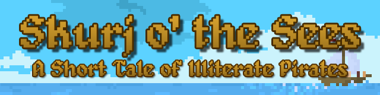
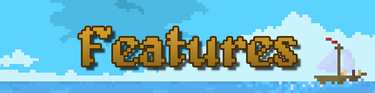
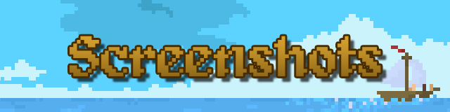
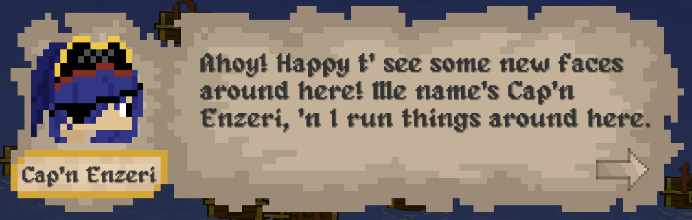
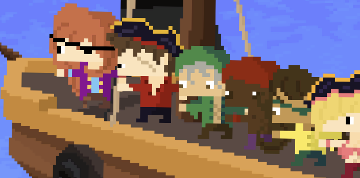
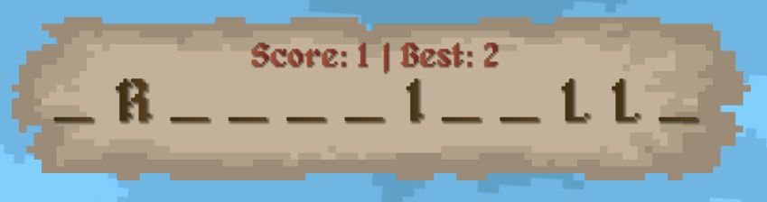
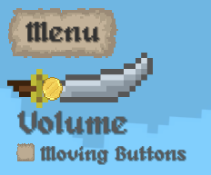
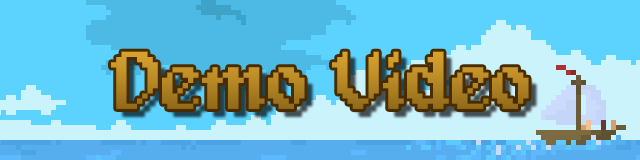
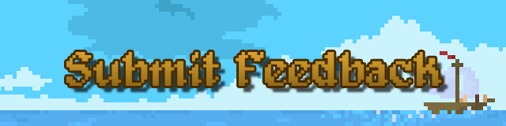

<h1 id="topBanner"align="center">
  
</h1>

  

[Releases][release]&nbsp;&nbsp;&nbsp;|&nbsp;&nbsp;&nbsp;[Features](#features)&nbsp;&nbsp;&nbsp;|&nbsp;&nbsp;&nbsp;[Screenshots](#screenshots)&nbsp;&nbsp;&nbsp;|&nbsp;&nbsp;&nbsp;[Demo Video](#demo)&nbsp;&nbsp;&nbsp;|&nbsp;&nbsp;&nbsp;[Issues][issues]

**[Skurj o' the Sees](https://maxheyn.github.io/hackman)** is a pirate-themed version of the classic game, [Hangman](https://en.wikipedia.org/wiki/Hangman), developed for the Clemson Computer Science Hackman Challenge during February 2022. It features completely from-scratch artwork by the [developer](https://github.com/maxheyn), and is available for Windows, Android, and Linux, as well as any platform which can run WebGL in their browser.

<h2 id="features" align="center">  
  
</h2>

Aside from your standard hangman features, Skurj o' the Sees adds...

- [Custom Art Assets](instagram.com/_maxyp00/)
    - All artwork is made from scratch by the developer!
- [Multiple Platforms][release]
    - Available on Windows, Android, Linux, and any platform which can run WebGL in their browser.
- [Immersive Gameplay](#demo)
    - Take on the role of a new recruit on a pirate ship and see if you can work together with your crew to improve their literary skills.
    - [Dialogue System](#dialogue)
    - [Animated Lives Display](#lives)
    - Swap between swaying or still buttons to change how you search for letters.
- [Bonus Pelican](#demo)
    - If you find a pelican, you can use it to help you find a letter that is in the word.
- [Atmosphereic Sound Effects](#demo)
    - Sounds effects and background music are included to make you feel as though you are on a real pirate ship.

<h2 id="screenshots" align="center">  
  
</h2>

  <h3>Dialogue System</h3>

  
    
  *Start your journey by meeting with the Sea Cap'n Enzeri. Find out more from her.*

  <h3>Animated Lives Display</h3>

  

  *Your remaining lives are displayed as your crewmates. Guess wrong they'll be walking the plank!* 

  <h3>Scoreboard</h3>

  

  *Check your current score, progress on guessing the word, and best score in the current session.*

  <h3>Menu</h3>

  

  *Simple menu to change volume and swap between button animations.*

<h2 align="center" id="demo">  
  
</h2>

https://user-images.githubusercontent.com/16215993/154369927-95f5ba9b-59cc-4424-a974-fea2108292ff.mp4

<h2 id="feedback" align="center">
  
</h2>

Have a suggestion for me, or want to report a bug? Open an [issue][issues]!

[Back to Top](#topBanner)&nbsp;&nbsp;&nbsp;|&nbsp;&nbsp;&nbsp;[Authors](https://github.com/maxheyn/hackman/graphs/contributors)

[release]:https://github.com/maxheyn/hackman/releases/latest "Latest Release (external link)"
[issues]:https://github.com/maxheyn/hackman/issues "Issues (external link)"
